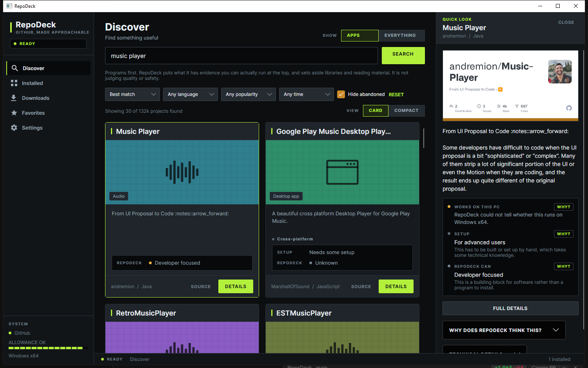
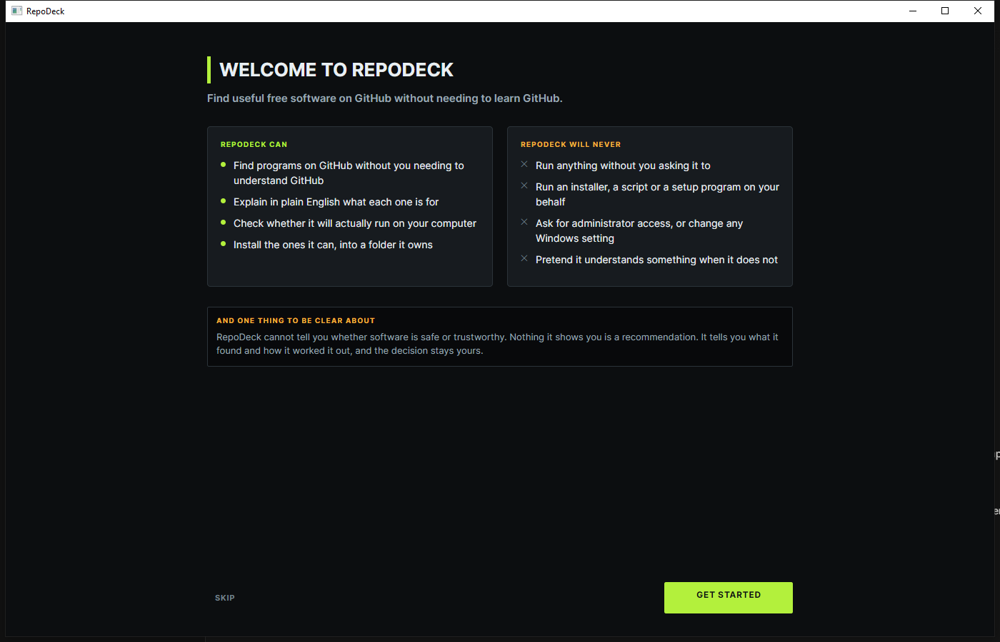

# RepoDeck

GitHub has a ridiculous amount of great free software on it. RepoDeck makes it easier to
actually use.

You search for what you want the computer to do. RepoDeck finds projects, explains in
plain English what each one is, works out whether it will run on your machine, and
installs the ones it can — into a folder it owns, without running anything on your behalf.



---

## What it does

**Finds programs.** Search in ordinary words — "edit videos", "send files", "music
player" — or browse by category. RepoDeck reads what it finds and tells you what it is
for, rather than showing you a repository and wishing you luck.

**Tells you whether it will work.** It looks at what the project actually publishes and
compares it with your computer: the operating system, the processor, whether there is a
ready-made build at all. The answer is a sentence, not a compatibility matrix.

**Explains how it decided.** Every verdict has a **WHY?** beside it. Pressing it shows the
evidence — which file it found, why that file matches your machine, what it could not work
out. Nothing is a black box, and you pick up the vocabulary by reading answers rather than
by having to know it first.

**Installs what it safely can.** Portable archives and standalone programs go into
RepoDeck's own folder. Anything it cannot install confidently is downloaded and handed to
you with the reason stated.

**Keeps it working afterwards.** It tells you when something you installed has a newer
version, shows you what that version is before you agree to anything, and swaps it in
safely — your old copy is kept until the new one is proved to work. If an installation gets
damaged, it can put it back.

## What works today

| | |
|---|---|
| Search and browse | Yes |
| Plain-English explanations | Yes |
| Compatibility checking | Yes |
| Installing portable builds and single executables | Yes |
| Running what it installed | Yes |
| Update checking | Yes |
| Updating, with rollback if it goes wrong | Yes |
| Repairing a damaged installation | Yes |
| Removing what it installed | Yes |
| Windows installers and Linux packages | Downloaded and handed to you, never run |
| Building from source | No, and not planned |

Windows x64 and Linux x64.

## Updating, without the usual anxiety

RepoDeck only offers an update it can actually show is newer. Projects name their releases
however they like, and when two names cannot be honestly compared, RepoDeck says it does not
know rather than guessing — because guessing wrong means offering you an older version with
the word "update" on the button.

When you do update, your working copy is never written into. The new version is downloaded,
unpacked somewhere separate and checked first. Only once it is ready is your current copy
moved aside — and it is kept until the new one has been checked in place. If anything fails
at any point, your previous version goes back.

Nothing is force-closed. If the program is running, RepoDeck says so before it downloads
anything, rather than after.

## How it keeps you in control

RepoDeck shows you the whole plan before it downloads anything, and asks:

- **what** it will download, by name and size
- **where** it will put it, by full path
- **what it will do**, step by step
- **what it will not do**, explicitly

It will not run an installer, a script or anything else it downloads. It will not ask for
administrator access. It will not change a Windows setting or touch anything outside its
own folder. It will not start a program until you ask it to.

And the thing it says at the front door, because it matters more than any feature:

> RepoDeck cannot tell you whether software is safe or trustworthy. Nothing it shows you
> is a recommendation. It tells you what it found and how it worked it out, and the
> decision stays yours.

Stars are not treated as a quality signal, popularity is never presented as an
endorsement, and "RepoDeck can install this" is a statement about RepoDeck rather than
about the software.



## Download

There is no release yet. Until there is, see **Building it yourself** below.

---

## Building it yourself

Requires the .NET 10 SDK, on Windows x64 or Linux x64.

```
dotnet build
dotnet run --project src/RepoDeck/RepoDeck.csproj
dotnet test
```

## GitHub rate limits

Without a token, GitHub allows 60 requests an hour and 10 searches a minute, which is easy
to exhaust. To raise the limits, set an environment variable before starting RepoDeck:

```
setx REPODECK_GITHUB_TOKEN your_token_here
```

A token with no scopes is enough for searching public repositories. RepoDeck never writes
the token to disk and never records it in the log.

## Where RepoDeck keeps its files

`%LOCALAPPDATA%\RepoDeck` on Windows, `~/.local/share/RepoDeck` on Linux. RepoDeck only
ever writes inside that folder, and only ever deletes files it put there itself.

## Look and feel

A dark, dense interface in the spirit of late-1990s media players and desktop utilities:
squared-off panels, small capitalised labels, segmented meters and one acid-lime accent
used sparingly enough to still mean something. Every status light sits beside a word, so
no state is carried by colour alone.

Projects with no pictures of their own get artwork RepoDeck draws for the kind of thing
they appear to be — a window, a waveform, a controller. Never an invented screenshot or
logo.

## How it is put together

See [docs/ARCHITECTURE.md](docs/ARCHITECTURE.md) for the design, and
[docs/STATUS.md](docs/STATUS.md) for what is done, what is not, and every known problem.

In short: discovering, understanding, planning and executing are kept separate; the
installer re-decides nothing, it carries out a plan that was written down and shown to
you; every write and delete is confined to RepoDeck's own folder and re-checked at the
point of use; uncertainty is a type rather than a string; and RepoDeck never renders a
verdict on whether software is safe.
