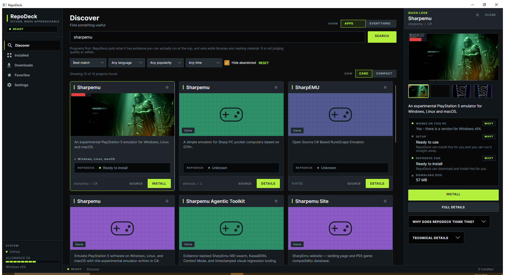
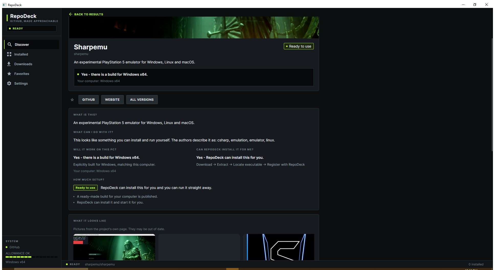
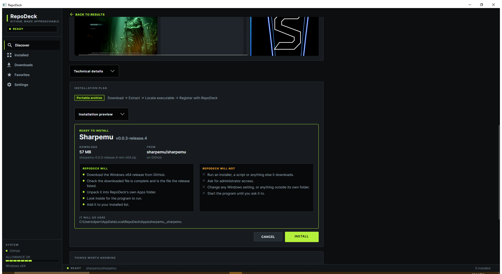

## RepoDeck

GitHub has a ridiculous amount of great free software. RepoDeck makes it easier to actually use it.
RepoDeck is a desktop app for finding, understanding, installing, and managing software from GitHub, even if you've never used Git before and have no idea what a repository, release, or build is.

Search for something you want, like "video editor," "music player," "send files," or "retro games." 

RepoDeck searches GitHub and turns the results into something closer to an app store.

Discover → Understand → Install → Run



Instead of expecting you to figure everything out yourself, RepoDeck helps answer the questions that actually matter:

- What does this program do?
- Will it work on my computer?
- How difficult is it to set up?
- Can RepoDeck install it for me?
- What exactly is RepoDeck going to download?
  
When RepoDeck finds a version it understands and can safely handle, it can download and install it for you. If it isn't confident about what it found, it tells you why instead of guessing or blindly running something.

You're always in control. RepoDeck doesn't silently run installers, scripts, or random code downloaded from GitHub.

Current status: RepoDeck is under active development. Searching, project analysis, compatibility checking, downloading, installation, launching, updating, and repairing supported apps are working.

What works today
- 🔎 Search GitHub using ordinary terms
- 🖼️ Find project screenshots and artwork
- 📝 Explain projects in plain English
- 🖥️ Check Windows/Linux/macOS compatibility
- ⚙️ Detect platform and architecture requirements
- 📦 Inspect GitHub Releases and downloadable files
- 🟢 Show when an app is ready for RepoDeck to install
- 🟡 Explain when additional setup may be required
- 📥 Download supported releases
- 🛡️ Install supported portable applications through a staged installation process
- ▶️ Launch installed applications
- 📚 Keep track of installed software
- 🔔 Check installed apps against their GitHub releases
- ♻️ Update them in place, keeping the old copy until the new one is proved to work
- 🩹 Repair an installation that has been damaged or partly deleted
- 🗑️ Remove what it installed, and only what it installed
- 🕓 Keep a plain-English record of everything it has done
- ⭐ Save projects to Favorites, whether or not they are installed
- 📂 Preserve downloads RepoDeck can't automatically install
- 🔍 Show the technical evidence behind RepoDeck's conclusions
- 🪟 Card and Compact browsing modes
- ⚡ Quick Look without leaving search results

GitHub without the GitHub homework

GitHub was built primarily for developers, so finding an interesting project is often the easy part. 
Actually figuring out how to use it can mean digging through README files, Releases pages, ZIP files, source code, platform names, and terms like win-x64.
RepoDeck handles as much of that detective work as it can.
Search results are presented as programs, not repositories. 
You get a picture, a simple description, supported platforms, setup difficulty, and whether RepoDeck can install it.
Select a result and Quick Look gives you the important details without taking you away from your search.
Want the technical details? They're still there. 
RepoDeck simplifies GitHub rather than hiding it.



Find apps or explore everything
APPS focuses on projects that RepoDeck has good reason to believe are actual programs you can use.
EVERYTHING opens up the broader world of GitHub, including developer tools, libraries, experiments, websites, and other projects.

You can also switch between the visual Card view and a denser Compact view.
Screenshots without pretending
RepoDeck looks for screenshots, artwork, and logos supplied by the project itself.
If a project doesn't provide useful images, RepoDeck creates a simple placeholder based on what it appears to be, such as a utility, game, command-line tool, or developer tool.
It never invents a fake screenshot or logo and presents it as belonging to the project.
A little old-school personality
RepoDeck takes some inspiration from the desktop software era of Winamp, LimeWire, and late-'90s/early-2000s utilities, without bringing back all of their questionable interface decisions.
The interface uses dark panels, compact controls, status lights, segmented meters, squared edges, and a restrained acid-lime accent.
Underneath the retro influence, it's still designed as a modern application with readable text, keyboard navigation, clear status labels, and accessibility in mind.

Staying up to date, without the anxiety

RepoDeck checks your installed apps against their GitHub releases and tells you what it found in the same plain English as everything else.

It only offers an update it can actually show is newer. Projects name their releases however they like, and when two names can't be honestly compared, RepoDeck says it doesn't know instead of guessing. Guessing wrong would mean handing you an older version with the word "update" on the button.

When you do update, your working copy is never written into. The new version is downloaded, unpacked somewhere separate, and checked first. Only once it's ready does RepoDeck move your current copy aside, and it keeps that copy until the new one has been checked in place. If anything fails at any point, your previous version goes back.

Nothing gets force-closed. If the program is running, RepoDeck says so before it downloads anything, rather than after.

If an installation gets damaged, deleted, or half-removed by something else, Repair fetches the same version you already had and puts it back through exactly the same safe swap. It won't quietly upgrade you while doing it.

What RepoDeck won't do?

RepoDeck deliberately takes a cautious approach to software it finds online.

It won't silently:
- run scripts from a repository
- compile random source code
- launch downloaded installers
- request administrator access
- modify your PATH or system configuration
- guess which program to launch when the answer is ambiguous
If RepoDeck doesn't know what to do safely, it stops and tells you.

It also shows you the whole plan first, every time:




Coming next:

Verifying downloads against a checksum published by the project, background update checks rather than only on request, and RepoDeck being able to find and update itself.

Building from source and running installers remain deliberately out of scope.


## Requirements

- .NET 10 SDK
- Windows x64 or Linux x64

## Build and run

```
dotnet build
dotnet run --project src/RepoDeck/RepoDeck.csproj
dotnet test
```

## GitHub rate limits

Without a token, GitHub allows 60 requests an hour and 10 searches a minute, which is
easy to exhaust. To raise the limits, set an environment variable before starting
RepoDeck:

```
setx REPODECK_GITHUB_TOKEN your_token_here
```

A token with no scopes is enough for searching public repositories. RepoDeck never
writes the token to disk and never records it in the log.

## Where RepoDeck keeps its files

`%LOCALAPPDATA%\RepoDeck` on Windows, `~/.local/share/RepoDeck` on Linux. RepoDeck only
ever writes inside that folder.

See `docs/ARCHITECTURE.md` and `docs/STATUS.md`.
